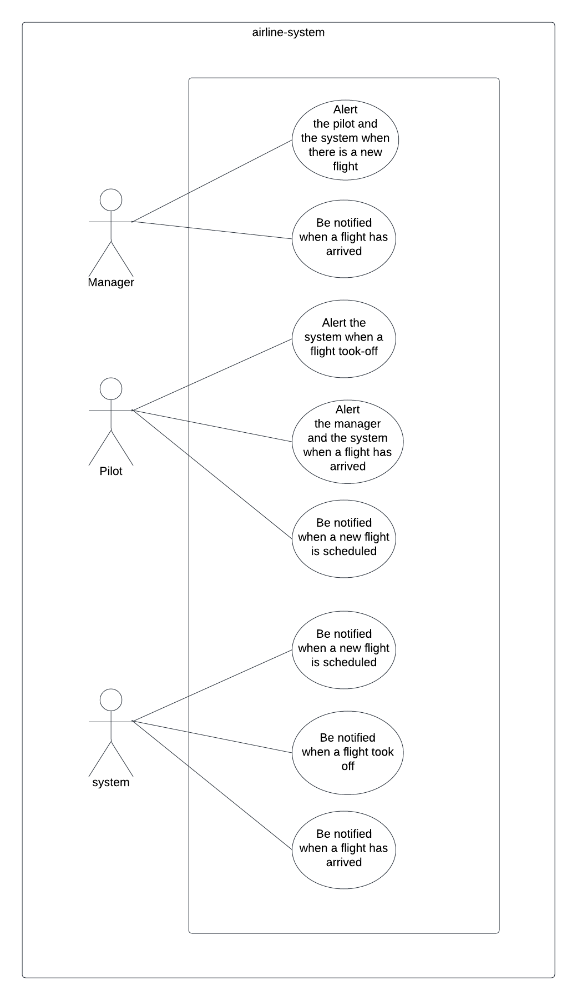

# Lab 11
## Event Driven Applications
Authors: Sham Al-Jalam

## URLs

*  pull request: [https://github.com/ShamAhmad2022/airline-system/pull/2](https://github.com/ShamAhmad2022/airline-system/pull/2)

### Running the app:

* node system.js
    ```Js
        Flight {
        event: 'new-flight’',
        time: 2022-02-28 15:30:13
        Details: {
        airLine: 'Royal Jordanian Airlines',
        flightID: 'ds7g86sa8v87dsv60v876d',
        pilot: 'Jane doe',
        destination: ‘ Manchester, UK’
    }
    }
    Flight {
            event: 'took_off',
            time: 2022-02-28 15:30:17
            Details: {
            airLine: 'Royal Jordanian Airlines',
            flightID: 'ds7g86sa8v87dsv60v876d',
            pilot: 'Jane doe',
            destination: ‘ Manchester, UK’
        }
    }
    Flight {
        event: 'arrived',
        time: 2022-02-28 15:30:20
        Details: {
        airLine: 'Royal Jordanian Airlines',
        flightID: 'ds7g86sa8v87dsv60v876d',
        pilot: 'Jane doe',
        destination: ‘ Manchester, UK’
    }
    }
    ```

* node manager.js
    ```Js
    Manager: new flight with ID ‘ds7g86sa8v87dsv60v876d’ have been scheduled
    Manager: we’re greatly thankful for the amazing flight, Jane doe
    Manager: new flight with ID ‘klaec9867ca79c6casc98y’ have been scheduled
    Manager: we’re greatly thankful for the amazing flight, Olive Yew.
    Manager: new flight with ID ‘bsiausgo9wd7a9797cscsc’ have been scheduled
    Manager: we’re greatly thankful for the amazing flight, Teri Dactyl.
    Manager: new flight with ID ‘flsakc90s7c9s9a8c789ca’ have been scheduled
    Manager: we’re greatly thankful for the amazing flight, Allie Grater.
    ```

* node pilot.js
    ```Js
    Pilot: flight with ID ‘ds7g86sa8v87dsv60v876d’ took-off
    Pilot: flight with ID ‘ds7g86sa8v87dsv60v876d’ has arrived
    Pilot: flight with ID ‘klaec9867ca79c6casc98y’ took-off
    Pilot: flight with ID ‘klaec9867ca79c6casc98y’ has arrived
    Pilot: flight with ID ‘bsiausgo9wd7a9797cscsc’ took-off
    Pilot: flight with ID ‘bsiausgo9wd7a9797cscsc’ has arrived
    Pilot: flight with ID ‘flsakc90s7c9s9a8c789ca’ took-off
    Pilot: flight with ID ‘flsakc90s7c9s9a8c789ca’ has arrived
    ```

### UML

